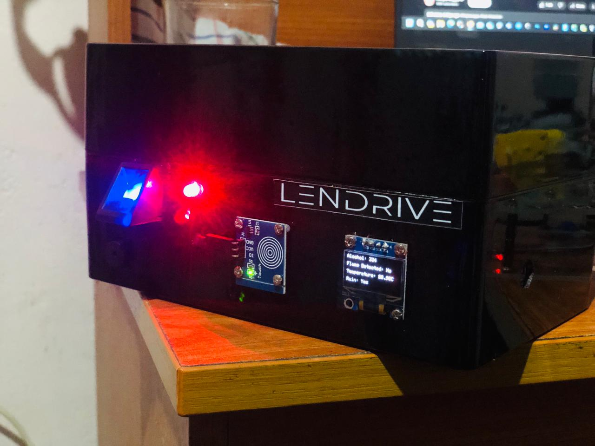

# Smart-Security-System-for-Vehicle-Lending
## Overview
This project is a smart security system aimed at ensuring the safety and proper management of vehicles lent to different users. It integrates cutting-edge technologies to offer real-time tracking, remote control, usage monitoring, and instant security alerts.

## Features
- **Real-Time Vehicle Tracking**: Keep an eye on your vehicle's location and movement at all times.
- **Remote Access Control**: Securely control your vehicle's locks and ignition remotely.
- **Environment Monitoring**: Alcohol Sensor, Flame Sensor, Rain Sensor, and Temperature Sensor operate based on environment and weather data.
- **Security Alerts**: Receive instant notifications for any security threats or unauthorized access.
- **User Authentication**: Ensure only authorized users can access and control the vehicle.
- **Report Generation**: Generate comprehensive reports for vehicle usage and security events.
- **Emergency Assistance**: Quick access to emergency services with an SOS feature
## How Demonstration Works
### Microcontroller (Arduino)
Positioned at the heart of the system, the microcontroller acts as its cerebral cortex. Responsible for processing inputs from various sensors, controlling actuators, monitoring the touchscreen interface, and managing external device communication, it organizes multiple operations of the system.

### Sensors
- **Alcohol Sensor**: Discerns the presence of alcohol in its vicinity, crucial for detecting unauthorized alcohol consumption in restricted areas.
- **Flame Sensor**: Detects fire or elevated temperatures, empowering the system to swiftly identify and mitigate potential fire hazards.
- **Temperature Sensor**: Gauges ambient temperature, contributing to environmental monitoring, facilitating safety assessments and interventions.
- **Rain Sensor**: Detects water droplets, playing a pivotal role in automated wiper control, enhancing visibility during inclement weather.
- **Touch Sensor**: Used to turn the system on/off.

### Actuators
- **Buzzer and LED**: Indicate the system's on/off status.
- **OLED Display**: Serves as the system's primary portal for user interaction, presenting real-time sensor data, alerts, and system statuses.

### Communication Modules
- **GSM Module**: Dispatches SMS alerts to designated phone numbers in response to security breaches or anomalous activities.
- **Fingerprint Sensor**: Acts as a biometric guard, introducing an additional layer of security by authenticating users through fingerprint recognition, ensuring authorized access to system functionality.

### Motor Module and Motors
- **Motor**: Acts as the engine of the vehicle.
- **Wiper Motor**: Functions as the wiper of the vehicle.
  
## Getting Started
Follow the [setup guide](docs/user-manual.md) to install and configure the system.

## Contributing
We welcome contributions! Please read our [contributing guidelines](docs/contributing.md) before submitting a pull request.

## License
This project is licensed under the MIT License - see the [LICENSE](LICENSE) file for details.

